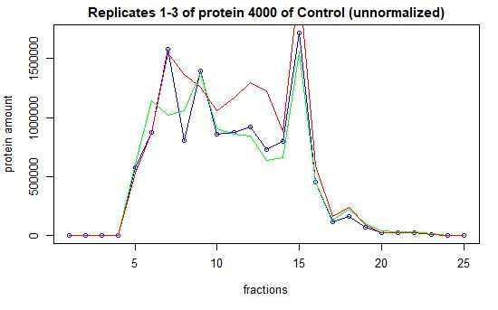
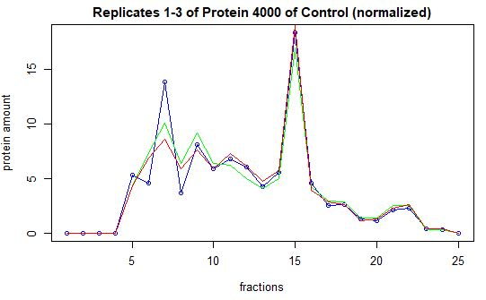
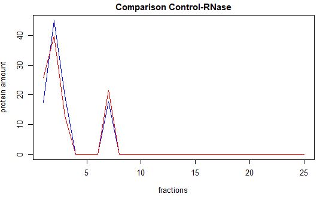
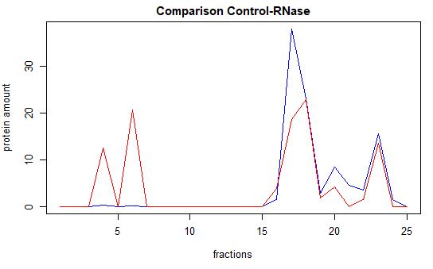
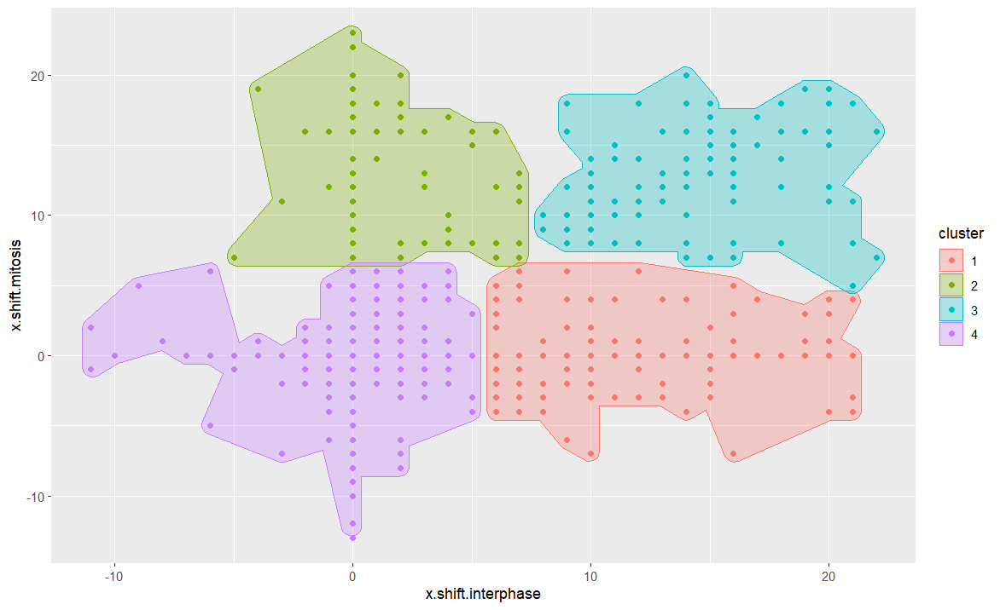
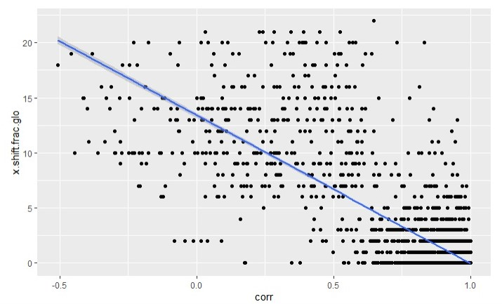

---
title: |
  **Final Report:**\
  Proteome-wide Screen for RNA-dependent Proteins HeLa Cells during Interphase and Mitosis\
   
author: |
  ### Group 5:    Marie Lulu Salein, Laura Herrfurth, Katharina Lotter, Kiren Nadeem\
  ### Supervisor: Dr Maïwen Caudron Herger\
  #### University of Heidelberg Summer Term 2022\
date: "19.07.2022"
output: html_document
---

   

## Table of Contents  
I.	Introduction  
1.1.	RNA-binding Proteins  
1.2.	Experimental Setup  
II.	Methods  
2.1.	Data Cleanup and Data Reduction  
&nbsp;&nbsp;&nbsp;2.1.1.	Data Reduction  
&nbsp;&nbsp;&nbsp;2.1.2.	Normalization  
&nbsp;&nbsp;&nbsp;2.1.3.	Removal of Batch Effects  
&nbsp;&nbsp;&nbsp;2.1.4.	Reproducibility  
2.2.	Determining Maxima and Shifts  
2.3.	Statistical Testing  
2.4.	k-means Clustering  
2.5.	Regression analysis  
III.	Results  
3.1.  RNA-binding proteins  
3.2.  k-means clustering  
3.3.  Regression analysis  
3.4.  Comparison with the R-DeeP and UniProt database
IV.	Discussion  
V.	Literature  

\newpage
## I. Introduction  
### 1.1. RNA-binding proteins  

 RNA plays a fundamental role in cellular processes, ranging from protein localization, to translation and post transcriptional alterations. The interaction of RNA and proteins enables a fine-tuned regulation of RNA via degradation and stabilization (Alberts 2015; Nelson 2021). In recent years the field of proteomics, which describes the analysis of proteins in a cell or tissue at a given time under specific conditions (Ginsburg and Willard 2009), has begun to focus on the discovery and understanding of molecular mechanisms related to RNA-dependent proteins. However, there are still many processes not yet fully understood, especially regarding the role of non-coding RNA (Caudron-Herger, Rusin et al. 2019).  

Instead of solely focusing on proteins which bind RNA directly, this analysis also includes RNA-dependent proteins, whose interactome depends on RNA without necessarily directly binding to it.  Instead of having classical RNA-binding domains (Lunde, Moore et al. 2007), these proteins can bind RNA via intrinsically disordered domains (Caudron-Herger, Rusin et al. 2019). For simplicity, if not stated otherwise the term RBP will be used for both RNA-binding and RNA-dependent proteins in this report.  

The interaction between RNA and proteins is highly diverse and dynamic, the binding can be cooperative or antagonistic. It responds to cellular as well as environmental stimuli, enabeling precise regulation (Sternburg and Karginov 2020). Common protein binding domains found in RBPs are for example the RNA recognition motif (RRM) or the zinc finger. The RNA interactome is also dependent on less specific interactions such as hydrogen bonds formed with the 2’Hydroxyl group or stacking interactions between π-bonds. RBPs contain intrinsically disordered regions, that loosen when the site of interaction becomes more rigid (Sternburg and Karginov, 2020). The interaction between RNA and the protein is best described as a dynamic rearrangement process, partly due to the flexibility of the tertiary sturcture of RNA (Sternburg and Karginov 2020). Moreover, in some cases the combination of multiple RNA-binding regions enables RBPs to exhibit a highly specific interaction pattern with RNA sequences, while at other times RBPs do not exhibit specific or high-affinity binding (Corley, Burns et al. 2020).  

At the moment there is a large study gap in RBP research, the common pull of studies only contains 215 proteins, which only amounts to approximately 10% of potential RBP candidates, so there is a need for more identification methods and comprehensive studies. The correct identification of RBPs  still remains a major challenge in RNA biology (Caudron-Herger, Rusin et al. 2019).  
Malfunctions in RBPs have severe consequences and are associated with a wide variety of diseases. The mutated splicing factor 3b subunit 1 causes cancer progression in CLL and the heterogeneous nuclear ribonucleoprotein A1 is an important protein in the progression and development of the neurodegenerative disorder ALS (Kelaini, Chan et al. 2021). Therefore targeting RBPs can be a promising approach in the field of translational research, introducing new treatment approaches and perhaps the possibility of novel cancer therapeutics using siRNA, RNA knockdown or RNA aptamers (Kelaini, Chan et al. 2021).  

During this project our aim was firstly to find out which proteins from the data set are RBPs by analyzing the shifts between the RNase and the control samples. We then wanted to see, if we could find RBPs associated with Actin, as it is an important protein for the cytoskeleton, which has to be regulated during the cell cycle (Alberts 2015). Lastly,  we compared the RBPs we found to the R-DeeP database and the UniProt database, to analyze further properties of the RBPs, such as common domains and functions. 
   

\newpage
## II. Methods
### 2.1. Experimental Setup

 The data we used was created during experiments with HeLa cells in interphase and mitosis. During mitosis the chromosomes, which have been replicated previously are divided into two new nuclei while interphase is mainly characterized by cell growth, DNA replication and preparation for mitosis (Alberts 2015).  

The cells were centrifuged and lysed. One sample was treated with RNase.  The sample of interest was placed on top of a sucrose gradient divided into 25 fractions. It then traveled through the gradient until it reached the point at which its density matched the one of the surrounding sucrose. If the protein of interest was a RBP it migrated to a different fraction in the sucrose gradient, depending on the presence or absence of RNA. The amount of protein in each fraction was detected. This method offers a quantitative approach which is able to detect both RNA-binding and RNA-dependent proteins. It further divides RBPs into right shift and left shift proteins as well as fully shifting and partially shifting, where the global maximum remains identical but the smaller peaks shift (Caudron-Herger, Rusin et al. 2019). 
 

## 2.2. Data Cleanup and Normalization
### 2.2.1. The Dataset

 The HeLa Interphase dataset consists of 7086 rows that represent the proteins and 150 columns which represent the 25 fractions of both the RNase sample and the untreated control sample. The measurements were made in triplicates. The class of the values was transformed to *numeric* for further calculations.  
The dataset was split into six subsets. For example, *colRep1rnase* contained all columns with measurements from the first replicate in the samples treated with RNase. In the next step the three subsets, describing either the control or the RNase samples were joined per column in order to get one data frame or each condition that contained all three replicates. 
  

### 2.2.2. Data Reduction

 Our first step was to remove rows (proteins) which only contained zeroes, as well as proteins where either the values of the RNase and the control sample were comprised of only zeroes, since these proteins could not be compared. 
  

### 2.2.3. Normalization

 One consequence of the experimental setup used to obtain our data was that heterogeneous amounts of proteins were used between replicates, but for further steps the compatibility of proteins in a fraction among each other was crucial, which is why fraction-wise normalization was performed.  
First, we adapted the amount of protein per fraction for each of the three replicates to be the mean of the two means lying closest to each other. We compared the fraction-wise sum of *Ctrl* and *RNase* before normalization and visualized them with a bar plot. Then the vector *mean_frac_rep* which contained the mean for each fraction in each condition and replicate was created. We used this vector to create another vector that contained the mean value of the two mean values for the protein amount of the replicates closest to each other in each fraction for RNase and control. Therefore,  we generated a *for-loop* that compared the three values by using an *if* and an *else if* condition to compare two variables at a time and check which ones are closest to each other. The normalized data was stored in *mean_rep* and again visualized with a bar plot that now showed the same height for all replicates, indicating the same amount of protein. To increase interpretability of the replicates of a protein, we then normalized the protein amount of each replicate for each protein to be 100 using the apply function. The amount of protein was now interpretable as a percentage, which we used when checking for local maxima and for the t-test. The values were stored in six different dataframes, one for each replicate and condition, which we later combined into the dataframes *TripCTrldat* and *TripRNasedat*, that combined the replicates for each condition. 
  

{#id .class width=50% height=50%}

{#id .class width=50% height=50%}

### 2.2.4. Removal of Batch Effects  

 Batch effects describe variations in the data or outliers caused by technical means without biological significance and which therefore might lead to over-interpretation of results or false conclusions. To remove proteins with a batch effect we compared the values of all three replicates for each fraction in each condition. If two values are zero and different from the third one at the same time, the third value (x) was set to zero as well. If two values (x,y) had numeric values and only the third measurement was 0, it was set to be the mean of x and y. To perform this, we used a *for-loop* with two different *if-conditions*. After the removal of batch effects, we checked if we now had proteins with only zeroes in either control or RNase and removed them. 
  

### 2.2.5. Reproducibility  

 We checked whether our data was reproducible with the alignment of the global and local maxima in *Rep1*, *Rep2* and *Rep3*. The maxima were allowed to differ in one fraction in the x-direction. We found that the position of the global maxima was within our set limits for each replicate, the changes were solely in the local maxima. We verified the maxima, by checking whether there is a distance of more than one fraction between the replicates by using the function *is.TRUE*, which gave us the output *TRUE* if the difference is only one fraction, therefore indicating the reproducibility of this protein. 
 

\newpage
## 2.3. Maxima and Shifts  
### 2.3.1. Global and Local Maxima  

 The global maxima of the plot represent the fraction of the sucrose gradient, which contained the highest amount of protein. We found this fraction searching for the maximum using the *which.max()* function. For every replicate the fraction of the global maximum was stored in the matrix *fraction_abs_max* in order to be able to compare them.  
Keeping in mind the experimental setup, it was essential to not only consider the global, but also the local maxima. As not only fully but also partially shifting RBPs exist, it was crucial to include local maxima, since their shifts are of biological significance. If after RNase treatment RNA and the protein either dissociate or gain new interaction partners, the molecules will migrate to different positions in the gradient, depending on their mass. This might for instance cause the appearance of new maxima.  
A characteristic global and local maxima have in common, is that the value for y (representing the amount of protein) is higher than its surroundings. This was chosen to be the first of our selection criteria. We defined a value as the local maximum, if both the two y-values to the left and to the right were smaller. For the fractions 1,2, 24 and 25 only the existing neighboring values were compared and had to be smaller. As this resulted in too many positions, which contained unspecific, relatively small maxima, which also could have been due to outliers we further implemented a y-threshold. The position was only considered a maximum, if the fraction contained at least 5% of the total amount of a protein. This was done to ensure the elimination of non-significant maxima. We chose to set this value to 5% instead of 3% or 7%, finding a middle ground that would neither lead to too many false negatives nor false positives.  
We created a matrix for each condition that had value of zero for every fraction, instead of the ones that contained the global and local maxima. 
 

### 2.3.2. Shifts  

 For a better usability of the data, we merged the curves of the three replicates for each condition using the mean.  In order to receive this average curve for every protein we generated a matrix with the average value of the protein amount of the three replicates for each protein per fraction. 
We then created a matrix for each condition that had value of zero for every fraction, except for the ones that contained the global and local maxima. 
We now used the matrices *meanRepctrl1* and *meanRepRNase* to plot two curves, one of the control and one for the protein after the RNase treatment, to visualize if there was a shift. For the examination of the local maxima, we created the function *compare_max* that gave us a matrix with the value *TRUE* at all positions where the local maximum shifted at least two fractions. We defined a shift to be a difference of at least two fractions in the positive or negative x-direction. 

{#id .class width=50% height=50%}

{#id .class width=50% height=50%}

## 2.4. Statistical Testing

 Statistical testing was used to provide a more objective predication whether or not the shift was significant instead of solely relying on visual perception and graphical representation. We chose to do this by using a t-test. As we assumed normality of the data due to its reproducibility the data fulfills the necessary condition for performing a t-test. Since we already implemented conditions for shifts in the x-direction, we now focused on the y-shift to tell, whether it is significant or not. While the-x shift shows the direction of the shift and can be used as an indicator whether the protein gains or loses interaction partners after RNase treatment, the y-shift between maxima represents the amount of protein, which changes the fraction after RNase treatment. 
 

{#id .class width=50% height=50%}

 In order to avoid coding mistakes and to focus on the interpretation of our results we used the predefined *t.test* function in R. We set our significance level to be 5% and used a two-sided t-test, therefore the shift of each protein which had a p-value smaller than 0.025 was determined significant. For the t-test we looked at the global maxima and the local maxima separately. Two vectors with the maxima of the RNase and the control were created and compared. 

Since we performed many t-tests in a row, we wanted to avoid the accumulation of alpha-errors, which is why we adjusted the p-value using an FDR correction. This is a method, used for correcting multiple comparisons in a statistical test, in order to avoid the accumulation of α-errors. 
  

\newpage
## Dimension Reduction Analysis  
### k-means clustering

 K-means clustering is an iterative, unsupervised clustering approach which is based on the Euclidean distance metric. We used the k-means approach to see, whether for certain properties of the proteins, such as the number of shifts, groups could be identified. 
The amount k of centers is pre-defined, each point is the assigned to the point closest to the centers. For each cluster the center of gravity is determined and the points are assigned to the closest center again. Fluctuations indicate the lack of a clear cluster structure, however this method identifies clusters, regardless of their biological significance. 
Therefore, the amount of centers has a great influence on the results. The two most common methods to determine the ideal number of centers are the Elbow and the Silhouette plot. When using the Elbow plot all pairwise distances squared between members of the same cluster are added, which gives the within square distance value (WSS). WSS is plotted against the number of cluster k, in general it decreases with increasing k, however upon reaching the optimal number of clusters adding more clusters does not improve WSS strongly, which can be seen as a kink in the curve.

For k-means clustering we used information obtained from the analysis of both data sets, which described the behaviour of HeLa cells during interphase and mitosis. 
We clustered the global x-shifts during interphase against the global x-shift during mitosis, in order to see if the proteins showed a different behaviour during the cell cycle. For interpretation the clusters were compared within each other corncerning proteins that shift left or right in their global maximum, shift in a local maximum or do not shift. 
  

### Linear regression Analysis

 The idea of linear regression is to predict a variable (y) from one or more explanatory variables (x) based on the linear relation between the input and output variable (y = mx + b). 
The regression analysis was performed with an overlap of proteins from the two different datasets.  
The idea was that when determining the correlation between the curves of the mean of the replicates from the RNase treatment and the control samples, the correlation should be lower if the proteins did not show a shift, as the curves would change only slightly in comparison to shifting proteins, where the curves had a larger difference.  
We tried to establish a predictive model to determine the absolute value of the x-shift of the global maximum from the correlation value between *meanRepRNase* and *meanRepCtrl*. The wider the x-shift the lower the correlation value should be. To further examine the relevance of the regression we checked that the residuals are normally distributed and that there is no correlation between the residuals and our explanatory variable. The root mean square error was used to evaluate the results. 
 

## III. Results

### Data Cleanup 

 After Data reduction, normalization and removal of batch effects we tested for reproducibility. 411 proteins that did not meet our criteria were removed from the Interphase dataset, as this difference in protein amount might have been due to experimental errors. From the verification of the reproducibility between replicates we assumed normality of the data which was used for statistical analysis. 

\newpage
### 3.1. RNA-binding proteins

 The main focus of this analysis was to determine whether a protein is RNA-binding or not. For this we plotted the amount of protein in each fraction before and after RNase treatment of the sample into one graph, to see if there would be a difference.
As defined by Caudron et. al., a protein is defined to be an RBP, if the amount of protein differs between the control sample and the RNase sample. To characterize the shifts, we considered the position of the maxima, as well as the direction of the shift.  Proteins could either show a full shift, where the global maximum changed position, or a partial shift, where the global maximum remained static, but the local maxima changed their position along the x-axis.
To avoid overinterpreation or false-positives we then performed a t-test on the shift in the y-direction to conclude if the shift is significant.  

After Data Cleanup and Data Reduction of the Interphase dataset we were able to find 1181 shifts in the global maxima, 989 partial shifts, where the local maxima changed position and 2107 proteins where either the local or global maxima or both changed along the x-axis. We then analyzed whether the shifts were significant, by looking at their y-dimension. 
After the implementation of the t-test and the FDR correction on the Interphase dataset, we found 1653 proteins, showing either a significant y-shift in the local and, or global maxima and 687 proteins having a significant y-shift in both the global and local maxima. When only looking at the significance of shifts in global maxima we found 182 significant proteins, whereas for the partial shifts, 784 y-shifts were significant. 

After the analysis of the Interphase dataset we implemented the same method for the Mitosis dataset. All steps were were performed the same way. In the Mitosis dataset we were able to identify 1673 proteins which either showed an x-shift in the global and or local maxima, 1045 proteins with a full shift and 913 proteins with a partial shift. After statistical testing, in regards to the y-shifts 869 proteins, which had a significant shift in the global and or local maxima remained. 
 

### 3.2. k-means clustering

 Following the result of the elbow plot, the k-means clustering led to four different clusters. They lie relatively close together due to similar input variable values, but are distinct from each other. When looking at tables that gave us the number of proteins with a left shift, right shift and a shift in the local maxima as additional info, it stands out that cluster 2 contains 171 RBPs that shift left in both cell cycle phases. In cluster 3 there are proteins that show the characteristic of an RBP during mitosis, but split up to all different kinds of categories of our shift analysis during interphase. For cluster 4 it behaves the opposite way. Adding the difference in the number of shifting maxima between *Ctrl* and *RNase* for interphase and mitosis as additional variables, does not result in a clearer structure. The last cluster cannot be interpretated clearly. It contains most of the proteins that do not shift (no RBPs). 
  

{#id .class width=50% height=50%}

\newpage
### 3.3.  Regression analysis

 Computing the pearson correlation against the x-shifts of the global maxima for our training data set resulted in a  value of - 0.82 showing the negative linear relation of these two variables. A low correlation results in a bigger x-shift and the other way around. The multiple R-squared value was 0.068. The application of our model based on the training data set onto the test data set showed that 68.06% of the total variance is explained by our model. Further examination showed that the residuals are normally distributed and that there is almost no correlation between the residuals and our explanatory variable. The root mean square error has a value of 1.91. 
 

{#id .class width=50% height=50%}

### 3.4. Comparison with the R-DeeP and the UniProt Database

 After performing these steps, we wanted to see, whether our determination method for RBPs was  accurate. For reference we used the R-DeeP database and used the proteins which had a full shift in the global maximum in the Interphase dataset. In total we analyzed 1181 proteins. In 708 cases R-DeeP identified the protein as an RBP as well, while for 473 proteins no data was available, or did not indicate that the protein was an RBP (Caudron-Herger et al. 2019). We found 92 proteins, which had not been previously identified as an RBP.   

When comparing the proteins we identified, the aim of the comparison was to see if we could find common features between RBPs. For this we looked at domains and functions. We also wanted to see if we had identified RBPs that were associated with actin and therefore important in the organization of the cytoskeleton.  We compared the RBPs we found with the R-DeeP database, which provided a visualization of protein shifts and gave a score how many times the protein had already been identified as an RBP. We found that right-shifts were rare and were often also associated with precipitated proteins, the majority of our proteins had a left-shift, indicating a loss of interaction partners after RNase treatment (Caudron-Herger et al. 2019).  For the 708 proteins, which were identified by R-DeeP as well, we looked at further properties. 
 
Using UniProt to compare domains and the function we saw that the proteins had important functions in chromatin reorganization, transcription and translation or the transition of phases in the cell cycle. We found several RBPs that were important for the function of the nucleosome, chromatin reorganziation, embroynic and brain development, as well as theregulation of the cell cycle. Defects in the latter could lead to cancer, for example in the case of H2A1A_HUMAN, whose malfunction might be involved in breast cancer
The lack of function of RBPs was also involved neurodevelopmental disorders.  When analyzing the molecular domains of RBPs, we were able to find similarities in the composition. Most RBPs had a compositional bias towards basic and acidic amino acid residues. Almost every protein contains disordered regions, which have previously been identified to be able to act as RNA-binding domains (Corley, Burns et al. 2020). They are unstructured and show no clear preference for specific RNA sequence, their interaction is most likely driven by electrostatic interactions (Balcerak et al., 2019). The RRM (RNA recognition motif) is the most common RNA-binding domain and was found in several 105 RBPs. The proteins that contained a Zinc finger domain were able to bind DNA as well, and occurred mostly in transcription factors and proteins regulating gene expression (Corley, Burns et al. 2020). The DEAD box or DEAH box, describes a Helicase domain, which is involved in metabolic processes concerning RNA, such as pre-mRNA splicing and translation initiation.Lastly, many RBPs contained a coiled coil motif, which is highly dynamic and allows for a quick adaption to changes in environmental stimuli and allow flexible interactions of the RBP (Ford et al. 2017).   
For our previous hypothesis regarding RBPs associated with Actin we were unable to find evidence. In total when looking at the shifts of the global maxima during Interphase we were able to find 18 proteins. The proteins , e.g. **ACL6B_HUMAN, AMOT_HUMAN, MYH0_HUMAN** etc. are involved in the organization of the actin cytoskeleton, cell division or had actin binding domains,  however as the number of proteins whose function is associated with Actin is low this is most likely a coincidence and not a significant finding. 
  

## IV. Discussion  

 During this project by using R-Studio we determined which proteins in a dataset were RBPs, by analyzing and comparing the shift in the amount of protein before and after RNase treatment in interphase and mitosis.  
In several steps decisions regarding the statistical analysis had to be made, which influenced the outcome. In the beginning when doing Data Reduction, we decided against implementing a threshold for zero values, as this might have led to the loss of proteins which show only very narrow peaks, and therefore the loss of important RBPs.  An alternative we considered when proving the reproducibility of the data, was using the correlation. Our theory was that the protein amount in the fractions had to be highly similar in case of reproducibility and would therefore yield values of r close to 1. This approach was replaced with the analysis of the x-positions of the maxima, since setting an arbitrary threshold for an R-value for correlation could have led to the loss of too many proteins, and the determination of maxima positions would be used for the shift analysis as well, therefore checking reproducibility with the maxima was thought to be more efficient.  
The global maxima were clear to identify, whereas finding the local maxima required more considerations. First, it was important to us, that only fractions which contained a large enough amount of proteins were considered a maximum, to avoid over-interpretation and to get meaningful results for the shifts. This was done by setting a threshold of 5 % of the protein mass, setting the value to 5% to avoid either identifying too many false positives or losing to many proteins. The second criteria to be considered a maximum was that the values of the two surrounding fractions to each side had to be lower.  
A protein was considered to be an RBP, when the maxima changed positions of at least two fractions in the positive or negative x-direction. Perhaps we would have had a higher outcome if we set the x-threshold to only one fraction, but as we had already used this difference for reproducibility and determining the maxima positions we decided on a higher threshold for this step.  
The k-means clustering resulted in four different clusters. The 171 proteins shifting left in both cell cycle phases are probably proteins that are constitutively expressed with the same function and binding behaviour in interphase and mitosis. It would be interesting to further examine these proteins concerning features and functions to find out if and what they have in common. Proteins in cluster 3 and 4 differ in their properties of RNA-binding dependent on the cell cycle phase. We clustered one variable against one other variable, however adding additional variables might improve the cluster structure and the outcome. So we tried adding more information which confirmed the clusters but without improvement of the total within-cluster sum of squares indicating that the number of shifting maxima is linked to the x-shift of the global maximum. Combining other variables would have probably led to clearer clusters. As cluster 4 contains many non-shifting proteins, we hypothesize that shifting proteins in this cluster show a smaller number of fractions their global maximum shifted, explaining why they are clustered together with the ones without a shift.  
Our regression model to predict the x-shift of the global maximum in interphase with the correlation of the averaged curves of the control and the RNase sample explains 68.08 % of the total variance, with a root mean square error of 1.91 which is relatively good keeping in mind that we are working with experimental data. The result affirms our hypothesis about linear relation of the two variables.     
When comparing our results with R-DeeP, we had a success rate of 59.9%. This accuracy could be higher, however it is most likely due to different analytical approaches and thresholds for maxima and shift determination . In additional steps for this analysis Gaussian fitting could have been done to determine RBPs as well, perhaps the amounts of correctly identified RBPs would have been higher.  Right shifts were far more rare than left shifts. They indicate a positive change in the density of the protein. This might be that the absence of RNA causes new binding sites in the proteins to become available and the protein gains interaction partners after the loss of RNA or could form complexes. These proteins might be RNA-dependent rather than RNA-binding, while left shifts indicate a loss of interaction partners, due to the digestion of RNA by the RNase (Caudron-Herger, Rusin et al. 2019).  

In conclusion our analysis was successful, but has room for improvement. With more experience an additional Gaussian fitting could have been performed with the curves to determine the shifts more accurately. Moreover, when choosing parameters, such as the y-threshold for the determination of local maxima we were aware this might have led to a loss of potential RBPs, however we decided to rather risk omitting potential candidates, instead of falsely identifying RBPs, which is why we set more strict conditions. 
Perhaps more proteins associated with actin could have been found, when also analyzing the proteins that showed shifts in the local maxima, or when comparing both datasets. What we were able to find however, was that the function of many proteins had to do with chromatin assembly or the cytoskeleton, which also essential for cell cycle. 
This quantitative approach of identifying RBPs lead us to identify 92 RBPs that, as told by R-DeeP had not been identified previously as RBPs, which once more shows the study gap in RBP research. Taking everything into consideration, RNA-dependent proteins were shown to be involved in almost all cellular processes, mainly in functions performed by RNA, such as transcription and  translation, but also in brain development, the regulation of the cell cycle and many others, showing their diverse range and therefore the importance of research on RNA-dependent and RNA associated proteins, which continues to be a promising field of research. 
  

\newpage
## V. Literature

Alberts, B. (2015). Molecular Biology of the cell (Garland Science).  

Balcerak, A., Trebinska-Stryjewska, A., Konopinski, R., Wakula, M., and Grzybowska, E.A. (2019). RNA–protein interactions: disorder, moonlighting and junk contribute to eukaryotic complexity. Open biology 9, 190096.  

Caudron-Herger, M., Rusin, S.F., Adamo, M.E., Seiler, J., Schmid, V.K., Barreau, E., Kettenbach, A.N., and Diederichs, S. (2019). R-DeeP: proteome-wide and quantitative identification of RNA-dependent proteins by density gradient ultracentrifugation. Molecular cell 75, 184-199. e110.  

Corley, M., Burns, M.C., and Yeo, G.W. (2020). How RNA-binding proteins interact with RNA: molecules and mechanisms. Molecular cell 78, 9-29.  

Einstein, J.M., Perelis, M., Chaim, I.A., Meena, J.K., Nussbacher, J.K., Tankka, A.T., Yee, B.A., Li, H., Madrigal, A.A., and Neill, N.J. (2021). Inhibition of YTHDF2 triggers proteotoxic cell death in MYC-driven breast cancer. Molecular Cell 81, 3048-3064. e3049.  

Ford, L.K., and Fioriti, L. (2020). Coiled-coil motifs of RNA-binding proteins: dynamicity in RNA regulation. Frontiers in Cell and Developmental Biology 8, 607947.  

Ginsburg, G.S., and Willard, H.F. (2009). Essentials of genomic and personalized medicine (Academic Press).  

Hashimoto, S., and Kishimoto, T. (2022). Roles of RNA-binding proteins in immune diseases and cancer. (Elsevier).  

Kelaini, S., Chan, C., Cornelius, V., and Margariti, A. (2021). RNA-Binding Proteins Hold Key Roles in Function, Dysfunction, and Disease. Biology 2021, 10, 366.  

Lunde, B.M., Moore, C., and Varani, G. (2007). RNA-binding proteins: modular design for efficient function. Nature reviews Molecular cell biology 8, 479-490.  

Nelson, D.L., Cox, Michael M. , Hoskins Aron A. . (2021). Lehninger principles of biochemistry, Eight edition Edition.  

Sternburg, E.L., and Karginov, F.V. (2020). Global approaches in studying RNA-binding protein interaction networks. Trends in Biochemical Sciences 45, 593-603.  

The UniProt Consortium
UniProt: the universal protein knowledgebase in 2021
Nucleic Acids Res. 49:D1 (2021)

